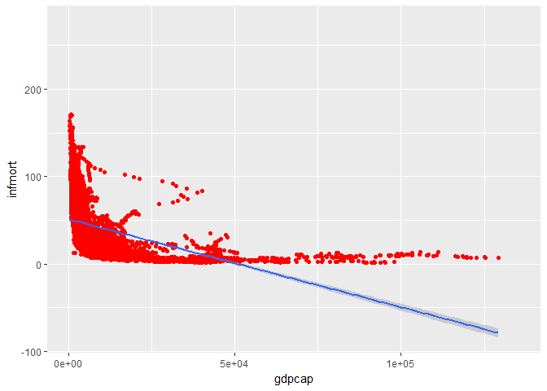
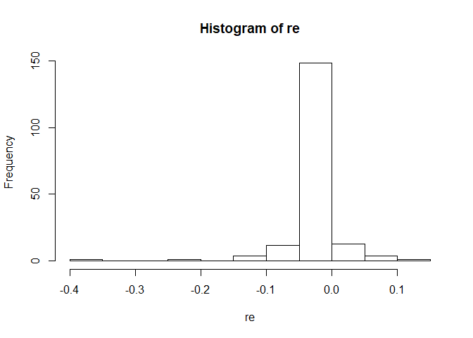
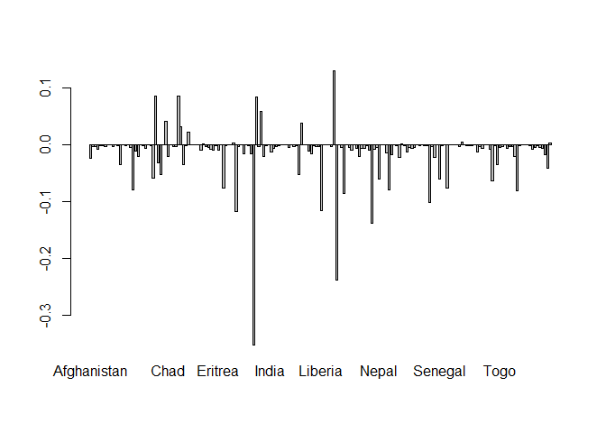

1.
--

#### a

``` r
library(purrr)
content <- mget(ls("package:base"), inherits = TRUE)
base_functions <- Filter(is.function, content)
name=names(base_functions)
len=map_int(name, ~ nchar(.))
max(len)
```

    ## [1] 34

``` r
name[len==max(len)]
```

    ## [1] "getDLLRegisteredRoutines.character"

#### b

``` r
library(dplyr)
```

    ## 
    ## Attaching package: 'dplyr'

    ## The following objects are masked from 'package:stats':
    ## 
    ##     filter, lag

    ## The following objects are masked from 'package:base':
    ## 
    ##     intersect, setdiff, setequal, union

``` r
argument=map_int(base_functions, ~ length(formals(.)))
a=argument[order(argument,decreasing=TRUE)[1:10]]
n1=names(a)
i=list(name=n1,length=a)
tbl_df(i)
```

    ## # A tibble: 10 x 2
    ##                name length
    ##               <chr>  <int>
    ##  1             scan     22
    ##  2   format.default     16
    ##  3           source     16
    ##  4          formatC     14
    ##  5 merge.data.frame     12
    ##  6        prettyNum     12
    ##  7             save     10
    ##  8          system2     10
    ##  9          library      9
    ## 10    print.default      9

#### c

``` r
length(argument[argument==0])
```

    ## [1] 226

The functions have no argument are the primary functions, they do not need to input an argument to work. ps: when I run this command directly in r studio, the output is 225, but when I knit to html,the output is 226. Since I use the windows system, I think it may be the problem of system or the version of R Studio. Just to aviod misunderstanding.

2.
--

#### a

``` r
library(WDI)
```

    ## Loading required package: RJSONIO

``` r
library(dplyr)
wdi=WDI(country = "all", indicator = c("NY.GDP.PCAP.PP.KD","SP.DYN.IMRT.IN"),
start = 1960, end = 2016, extra = TRUE, cache = NULL)
data= wdi %>% select(country, year, gdpcap="NY.GDP.PCAP.PP.KD", infmort="SP.DYN.IMRT.IN", region) %>% filter(region!="Aggregates")
sorted=data %>% filter(year=="2015",infmort!="NA") %>% arrange(desc(infmort)) %>% select(year, country, infmort, gdpcap)
n=nrow(sorted)
tbl_df(sorted[c(1:5,(n-4):n),])
```

    ## # A tibble: 10 x 4
    ##     year                  country infmort     gdpcap
    ##  * <dbl>                    <chr>   <dbl>      <dbl>
    ##  1  2015                   Angola    96.0  6231.0680
    ##  2  2015 Central African Republic    91.5   626.4109
    ##  3  2015             Sierra Leone    87.1  1316.0601
    ##  4  2015                  Somalia    85.0         NA
    ##  5  2015                     Chad    85.0  2047.6372
    ##  6  2015                    Japan     2.0 37818.0908
    ##  7  2015                   Norway     2.0 63669.5253
    ##  8  2015                  Finland     1.9 38993.6707
    ##  9  2015                  Iceland     1.6 42674.4240
    ## 10  2015               Luxembourg     1.5 95311.1140

To keep only country entries, I rule out the lines that region=Aggregates (so the lines like "world", "upper income countries" will not be kept)

#### b

``` r
reg=lm(infmort ~ gdpcap , data =data)
reg
```

    ## 
    ## Call:
    ## lm(formula = infmort ~ gdpcap, data = data)
    ## 
    ## Coefficients:
    ## (Intercept)       gdpcap  
    ##   51.173949    -0.001005

``` r
library(ggplot2)
ggplot(data,aes(x=gdpcap,y=infmort))+geom_point(color='red')+geom_smooth(method='lm')
```

    ## Warning: Removed 7403 rows containing non-finite values (stat_smooth).

    ## Warning: Removed 7403 rows containing missing values (geom_point).



The gdp per capital and the infant mortality are negatively correlated. When the gdp increase from a small value, the infant mortality decreases rapidly; when the gdp increase from a larger value, the slope becomes smaller. ps: since we are required to run an overall linear regression, I think the regression fit line should be a linear one as well. So I make such a plot. If we want to fit the points better, we can also use command : ggplot(data,aes(x=gdpcap,y=infmort))+geom\_point(color='red')+geom\_smooth()

#### c

``` r
regions <- split(data, data$region)
fit_reg <- function(df) {
  lm(infmort ~ gdpcap, data = df)
}
regions=regions[2:8]
result=regions %>% map(fit_reg) %>% map(~ coef(.)) %>% map_dbl("gdpcap")
result=result[order(result,decreasing=TRUE)]
name1=names(result)
f <- list(region=name1, coef=result)
tbl_df(f)
```

    ## # A tibble: 7 x 2
    ##                                           region          coef
    ##                                            <chr>         <dbl>
    ## 1                                  North America -1.410946e-06
    ## 2 Middle East & North Africa (all income levels) -3.439549e-04
    ## 3      Europe & Central Asia (all income levels) -5.860830e-04
    ## 4        East Asia & Pacific (all income levels) -6.399345e-04
    ## 5  Latin America & Caribbean (all income levels) -1.356954e-03
    ## 6         Sub-Saharan Africa (all income levels) -2.423680e-03
    ## 7                                     South Asia -7.437168e-03

#### d

``` r
d=data%>% filter( infmort!="NA", gdpcap!="NA")
countrys <- split(d, d$country)
fit_reg <- function(df) {
  lm(infmort ~ gdpcap, data = df)
}
re=countrys %>% map(fit_reg) %>% map(~ coef(.)) %>% map_dbl("gdpcap")
n=names(re)
positive=re[re>0]
length(positive)/length(re)
```

    ## [1] 0.09782609

``` r
#walk(re, hist)
hist(re)
```



``` r
barplot(re)
```



``` r
re[re==min(re)]
```

    ##     Guinea 
    ## -0.3521231

The slope of overall regression estimated in part (b) is -0.001005. We can see from the barplot that the most at odds is the country with the smallest slope, the abs(coef-(-0.001005)) is the largest. So it is the Guinea.

#### e

``` r
fit_reg2 <- function(df) {
  lm(infmort ~ gdpcap+I(gdpcap^2), data = df)
}
r1=countrys %>% map(fit_reg)%>%map_dbl(~ summary(.)$adj.r.squared)
r2=countrys %>% map(fit_reg2)%>%map_dbl(~ summary(.)$adj.r.squared)
mean(r1)
```

    ## [1] 0.667917

``` r
mean(r2)
```

    ## [1] 0.7405935

Without a added squred term, the adjusted r square is 0.667917. And with a added squred term, the adjusted r square is 0.7405935. The adjusted r square is larger in the second model, the regressions of infant mortality on GDP per capita and the square of GDP per capita. I would recommend to keep the squared term.
