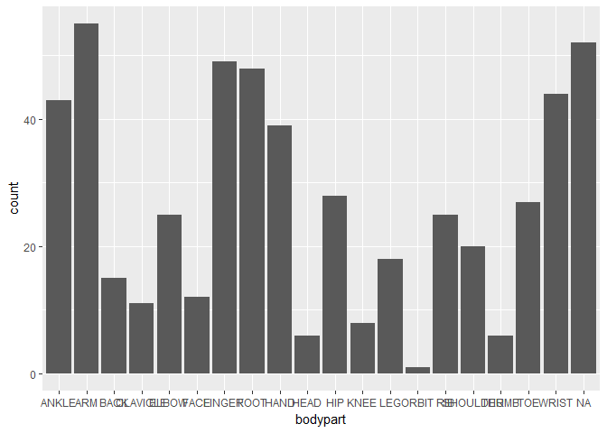
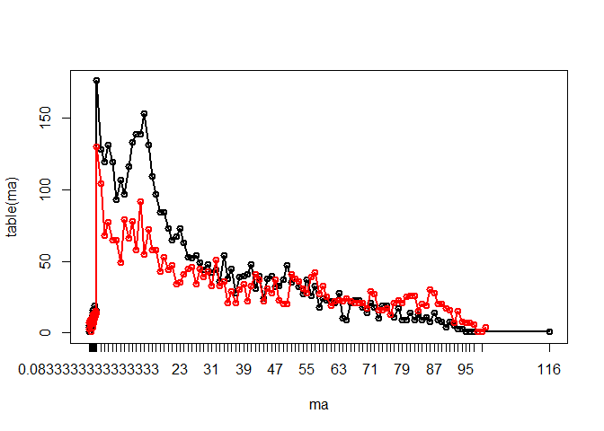

1.
--

#### a.

``` r
library(stringr)
```

    ## Warning: package 'stringr' was built under R version 3.4.2

    ## 
    ## Attaching package: 'stringr'

    ## The following object is masked _by_ '.GlobalEnv':
    ## 
    ##     words

``` r
library(purrr)
word=words$word
containz=str_subset(word, "z")
number_as <- str_count(containz, "z")
table(number_as)
```

    ## number_as
    ##   1   2   3 
    ## 909  81   1

``` r
contain2z=containz[str_count(containz, "z")==2]
contain3z=containz[str_count(containz, "z")==3]
k2=str_locate_all(contain2z, "z")
k3=str_locate_all(contain3z, "z")
distance2=map_dbl(k2, ~ (.[2, 1]-.[1,1]))
distance3=map_dbl(k3, ~ max((.[2, 1]-.[1,1]), (.[3,1]-.[2,1])))
conz=c(contain2z, contain3z)
dis=c(distance2,distance3)
m=max(dis)
print(paste("the distance is", m))
```

    ## [1] "the distance is 8"

``` r
conz[dis==m]
```

    ## [1] "százharminczbrojúgulyás"

#### b.

``` r
vowel=str_subset(word, "^[aeiouAEIOU].*[aeiouAEIOU]$")
vowel1=str_subset(word, "^[aeiouAEIOU]$")
length(vowel)+length(vowel1)
```

    ## [1] 14458

``` r
vowel2=str_subset(word, "^[aeiouAEIOU][aeiouAEIOU]+")
length(vowel2)
```

    ## [1] 2581

``` r
containv=str_subset(word, "[aeiouAEIOU]")
t=str_extract(containv, "[aeiouAEIOU]+")
con_vowel=str_length(t)
#table(con_vowel)
max=max(con_vowel)
max
```

    ## [1] 20

``` r
containv[con_vowel==max]
```

    ## [1] "frseeeeeeeeeeeeeeeeeeeefrong"

#### c.

``` r
ie=str_extract(word, ".ie")
ei=str_extract(word, ".ei")
table(ie)
```

    ## ie
    ## aie bie cie die fie gie hie kie lie mie nie oie pie rie sie tie uie vie 
    ##  11  20 138 248 148  12 164  26 390  24  69   2 157 762  56 189  81  74 
    ## wie xie yie zie 
    ##   8   4   9  18

``` r
#table(ei)
print(paste("there are", length(str_subset(word, ".ie")), "words have i before e, and there are", length(str_subset(word, "cie")), "words have c before ie, which doesn't follow the rule"))
```

    ## [1] "there are 2610 words have i before e, and there are 138 words have c before ie, which doesn't follow the rule"

``` r
#print(paste("there are", length(str_subset(word, ".ei")), "words have e before i, and there are", length(str_subset(word, "cei")), "words have c before ei, which follows the rule"))
print(paste("the ratio of words follow the rule is",1-length(str_subset(word, "cie"))/length(str_subset(word, ".ie"))))
```

    ## [1] "the ratio of words follow the rule is 0.947126436781609"

The rule seems to be correct.

2.
--

``` r
library(readr)
library(ggplot2)
```

    ## Warning: package 'ggplot2' was built under R version 3.4.2

``` r
data=read_csv("emergency.csv", col_names = FALSE)
```

    ## Parsed with column specification:
    ## cols(
    ##   X1 = col_character()
    ## )

#### a.

``` r
emerg=data$X1
len=str_length(emerg)
max=max(len)
min=min(len)
emerg[len==min]
```

    ## [1] "ABR HIP ON FLOOR" "INGESTION OF ***"

``` r
emerg[len==max]
```

    ##  [1] "40YOM-C/O FOOT/HEEL PAIN RUNNIJNG BACKWARDS FELT TEARING SENSATION IN F OOT AFTER WARM UP EXERCISES FOR SOCCER  DX PLANTER FASCITIS ACUTE FLARE"  
    ##  [2] "19MOWF  PARENTS HOLDING PT.  DAD STATES SHE WAS SLIDING DOWN SLIDE, WEA RING SHOES & LEG GOT CAUGHT ON THE SLIDE AT PARK.  DX. FX L PROX TIBIA."  
    ##  [3] "44YOF  PT HAVING SEVERE R ARM PAIN THAT IS RADIATING INTO NECK, BEGAN Y ESTEREDAY.  PLAYED TENNIS ON MONDAY, DESCRIBES AS THROBBING. DX. R SHOU"  
    ##  [4] "57 YO F WAS POURING KEROSENE OVER AN OPEN FLAME TO LIGHT GRILL WHEN FLA ME CAUGHT ON HAND. FAMILY MEMBER PUT OUT FLAME. NOT FDA. DX:1ST DG BURN"  
    ##  [5] "13YOM DID OUTDOOR WORKOUT X1 1/2 HRS, DEVELOEPD HEADACHE, TUNNEL VISION , THEN PLAYED FOOTBALL, WATCHING TV AFTER W/HEADACHE; MIGRAINE HEADACHE"  
    ##  [6] "DX NASAL CONTU AND ABRASION: 5YOM PLAYING ON COUCH, FELL OFF STRUCK NOS E AND FACE, NASAL SWELLING AND ABRASIONS. FELL HITTING TABLE FACIAL INJ"  
    ##  [7] "55YOF PT DROPPED CHAMPAIGN BOTTLE AT HOME WHICH HIT BACK OF HER LEG THE N PT STEPPED ON GLASS.  DX.  LAC R HEEL & LAC L GREAT TOE, ACHILLE TEND"  
    ##  [8] "75YOM  PT IN BATHROOM AT NH, TURNED TO GO TO BED AND HIT HEAD ON DOOR F RAME & THEN FELL DOWN AND HIT BACK.  DX.  HEAD INJURY, LUMBOSACRAL STRA"  
    ##  [9] "TRAUAMTIC ARM PAIN CHOPPING WOOD WITH AN AXE, AXE HEAD FLEW OFF HIT PT. DX-NAIL  IN UPPER ARM. DX-FOREIGN BODY UPPER ARM, PUNCTURE WOUND WRIST."  
    ## [10] "^64YOM LIFTING A CAR BATTERY OUT OF HIS CAR AND TWISTED AWKWARDLY AND N OW HAVING SEVERE PAIN DOWN LOWER BACK ADMIT FOR INTRACTABLE LUMBAR PAIN"  
    ## [11] "CHI W/SCALP LAC.& FOREHEAD CONT.:20MOM DAD SHUT REFRIGERATOR DOOR,GLASS CAKE PAN FELL FROM FRIDGE,HIT STOVE,BROKE,HIT PT IN HEAD, LG CONT, LAC."  
    ## [12] "43YOM WAS USING A CIRCULAR SAW LAST PM CUTTING WOOD WHILE DRINKING ETOH &IT SLIPPED C/O LEFT RING FINGER PAIN.DX:LEFT RING FINGER AMPUTATION,+E"  
    ## [13] "91YOWM  PT BROUGHT FROM INDEP LIVING, ON HOSPICE CARE, WAS USING A CHAI R TO BALANCE HIMSELF & FELL OFF CHAIR & HIT BACK OF HEAD. DX. LAC SCALP"  
    ## [14] "26YOF  PT C/O R FOOT PAIN W/BRUISING AND SWELLING, STATES LAST NIGHT SH E WENT TO KICK A BALL TO HER DOG AND KICKED HER DRESSER. DX. FX R 5TH M"  
    ## [15] "26 YO M INJECTING MORPHINE INTO R ARM, DEVELOPED SWELLING AND USED RAZO R BLADE TO CUT OPEN AREA AND DRAIN, NOW PAINFUL DX R FOREARM CELLULITIS"  
    ## [16] "12YOF FELL OFF OF A BENCH WHILE AT SCHOOL, THE BENCH FELL AND HIT HER L LEG AND THEN SHE FELL ONTO LEG PT HAS PAIN, DX CONTUSION TO L LOWER LEG"  
    ## [17] "PT FELL AND STRUCK BACK OF HEAD ON A CONCRETE FLOOR DURING A COMPETITIV E DANCE COMP 2 DAYS AGO. NO LOC. NAUSEA, HEADACHES SINCE. DX CONCUSSION"  
    ## [18] "10YOM; PT WAS GETTING DRESSED IN FRONT OF THE HEATER WHEN HE BEGAN TO G ET A HEADACHE AND FELT SICK & PASSED OUT.  D: CARBON MONOXIDE POISONING"  
    ## [19] "58YO F ON BICYCLE WHEN HER HUSBAND, ALSO ON BICYCLE, CRASHED IN FRONT O F HER CAUSING HER TO HIT HIS BIKE. WEARING HELMET. DX:HIP/THIGH CONTUS."  
    ## [20] "11 YOF WAS JUMPING ON THE BED, AT HOME, & FELL ONTO A PAIR OF SCISSORS, THEY WENT INTO HER CHEST.  DX: HEMOTHORAX SECONDARY TO PENETRAT. TRAUMA"  
    ## [21] "40 YO M WITH SYNCOPE AND DIZZINESS. RECENT SCUBA DIVING EXPERIENCE 4 DA YS AGO WHERE HE DID 2 DIVES 2X A DAY UP TO 80FT. DX; SYNCOPE, HEADACHE."  
    ## [22] "DX SYNCOPE/LAC FACE/TOOTH FX: 25YOF STOOD F TOILET, FELT DIZZY, SYNCOPA L, 1CM LAC TO CHIN, + CHIP' 3 TEETH TO L UPPER, PN TO CHIN, WOKE ON FLR"  
    ## [23] "37YOM  PT STATES HE HAD A NAIL STUCK IN HIS L FOOT 2 WKS. AGO.  DOG HAS STEPPED ON HIS FOOT TWICE & FOOT HAS SWELLING.  DX.  PW L FOOT, CELLULI"  
    ## [24] "61 YOM, WOKE UP, DIZZY,HAND FELL THRU WINDOW, CUT FINGER, DAUGHTER CLEA NED FINGER,PT'S EYES ROLLED BACK,UNRESPONSIVE DX: TIA VS SYNCOPE VS SEI"  
    ## [25] "8MOF; PT WAS GAGGING AND MOM SWIPED A PIECE OF TAPE OUT OF BABYS THROAT ; PT WAS SEEN PLAYING WITH A SNOWFLAKE THAT HAD TAPE ON BACK.  D: CHOKI"  
    ## [26] "24YOM  R HAND/R WRIST PAIN AFTER HITTING A WALL TODAY.  PER PT, WAS SHA DOW BOXING TODAY & ACCIDENTALLY HIT WALL.  DX. FX R 5TH METACARPAL BASE"  
    ## [27] "3MOF IN GRANDMAS ARMS, WENT TO SIT DOWN ON COUCH, HIT EDGE AND SLID ONT O FLOOR, PT FELL ONTO FLOOR ON HER BACK. FUSSY SINCE. DX BACK CONTUSION"  
    ## [28] "AT  HOUSE- FELL ONTO BACK OF HIS HEAD, WHILE  ROLLERSKATING,THEN PASSED OUT, HIT HIS FACE ON THE FLOOR-LOC FOR 1 MIN. WEARING GLASSES. DX: CHI,"  
    ## [29] "44YOWM  PT C/O L HAND LAC AFTER CUTTING IT AT HIS HOME WITH A KNIFE WHI LE TRYING TO PRY APART FROZEN MEAT.  DX. LAC PALM OF HAND 1 1/2 IN LONG"  
    ## [30] "89YOWF  RESIDENT OF NH FOUND ON FLOOR.  C/O L LHIP PAIN, CHRONIC R SHOU LDER PAIN, CONT TO L FH.  HAD FALLEN FROM CHAIR.  DX.  L FH HEMATOMA, L"  
    ## [31] "17MOBM  MOM STATES CHILD WAS IN THE FLOOR AND SHE NOTED STRANGE SMELL T O BREATH, SMELLED OF FINGERNAIL POLISH REMOVER.  DX. INGESTION NON-ACET"  
    ## [32] "79 YO F, C/O RT SHOULDER, FACIAL PAIN, WAS WALKING DOWN 3 STEPS, KNEE G AVE OUT,SHE FELL,STRIKING RT SHOULDER,FACE,DX UPPER ARM FX,FOREHEAD ABR"  
    ## [33] "DX CONTU ABD WALL/CONTU HIP: 46YOF MISSTEPED ON TOP STEP AND \"BUMPED\" R UQ AFTER FALLING DOWN 5 WOODEN STAIRS; PN OVER COCYX AND PN OVER R RIBS"
    ## [34] "7YOM PT TRIPPED AND FELL HITTING HIS HEAD ON A METAL FENCE. NO LOC. ACT ING FINE THEN BEGAN HAVING SEIZURE ACT. POST ICTAL. DX CONCUSSION W/ SZ"  
    ## [35] "HELMETED 41YOM RIDING W/A GROUP OF CYCLISTS@UNK SPEED WHEN PT WAS CLIPP ED BY ANOTHER CYCLIST GOING OVER HANDLES C/O BACK PAIN.DX:T8 FX S/P BCC"  
    ## [36] "DX SYNCOPE/PROLONGED QT/CHEST PN: 49YOF COMPETING AT SPECIAL OLYMPICS T ODAY (SOCCER THIS A.M. AND INDIVIDUAL SKILLS THIS P.M. HAND SYNCOPAL EP"  
    ## [37] "17YOM WITH FINGER FX LAST WEEK, HAD SPLINT PLACED IN ED, DECIDED TO PLA Y FOOTBALL GAME REINJURING SAME FINGER, TRAINER PUT BACK IN PLACE;REINJ"  
    ## [38] "9 YO M PT WAS CLIMBING ON A FISH TANK AND FELL THROUGH CUTTING BOTH THI GHS ON SOME STAPLES HOLDING TANK TOGETHER.DX 5CM LACERATION BOTH THIGHS"  
    ## [39] "16YOF IN FRIEND'S CAR WHEN PUT ON LATEX GLOVES, REMOVED GLOVE & PUT THU MB IN MOUTH, DEVELOPED TONGUE NUMBNESS, LIP SWELLING; ALLERGIC REACTION"  
    ## [40] "UNHELMETED PT RIDING MOTOR SCOOTER WHEN HE WAS GOING TOO FAST DOWN A HI LL & WAS GRAZED BY A CAR @ UNK SPEED.DX:KNEE FRACTURE,KNEE SPRAIN,CONTU"  
    ## [41] "19YO HISP MALE AT HOME WAS SHOT IN R EYE WITH PAINTBALL GUN, MILD BLURR Y VISION & PAIN, DX EYE CONTUSION,MONOCULAR VISION LOSS TRAUMATIC HYPHE"  
    ## [42] "DX PNEUMOMEDIASTINUM: 19YOM WT-LIFT' (BENCH PRESS & SQUATS) @ GYM TODAY , TAK' NAP ~3HRS LATER & WOKE UP W CHEST & NECK PN DESCRIBED AS PRESSUR"  
    ## [43] "21MOF IN LIVING ROOM,FOUND W/BURN THUMB,OTTOMAN ON FIRE NEXT TO GAS FIR EPLACE NOT LIT,THINKS PUT CHRISTMAS TREE TWIG IN PILOT LIGHT;BURN NO FD"  
    ## [44] "2YOF DX: CONTUSION,FACE(EXCEPT EYES). PT PLAYING W/ SIBLING & FELL INTO CORNER OF TABLE IN LIVING RM FROM STANDING POSITION, MARK BELOW RT EYE*"  
    ## [45] "68YOF  PT WITH DECREASE ROM TO R ELBOW X 2-3 DAYS.  MAY HAVE INJURED EL BOW ROLLING OUT OF BED AT HOME.  DX. PAIN R ELBOW, R LATERAL EPICONDYLI"  
    ## [46] "21 YOM LACERATION TO LT HAND REPORTS WAS OPENING UP A BOTTLE OF CHAMPAG NE W/A CORK OPENER WHEN THE CORK FLEW & BOTTLE BROKE.+LAC TO LT FINGER%"  
    ## [47] "1MOF COUGH/WHEEZE X2W OR SINCE BIRTH, POSS INHALED SMOKE 1.5WA WHEN ELE CTRIC STOVE CAUGHT FIRE @ HOME, FIRE ISOLATED 2 STOVE, FD?;COUGH/WHEEZE"  
    ## [48] "72YOM AT HOME IN THE GARAGE STANDING ON A WOODEN SHELVE & IT BROKE CAUS ED PT TO FALL DX LIP LACERATION, RIB FRACTURE, SKIN TEAR, MECHANICAL FA"  
    ## [49] "14YOF PT DIABETIC, HAVING INTENSIVE VOLLEYBALL TRY OUTS LAST COUPLE WEE KS, STARTED VOMITNG, ELEVATED BLOOD SUGAR LAST NIGHT; VOMITING, HIGH BS"  
    ## [50] "55YOF  PT WAS WORKING ON TILLER AT HOME AND WHEN FIRED IT UP, IT HIT ME .  THE FENDER OF TILLER SLICED L LEG TO BONE. DX. L LOWER LEG LAC, LEFT"  
    ## [51] "10 YOM WAS PLAYING BASEBALL, WITH A FRIEND, & GOT HIT IN THE MOUTH BY A BASEBALL- TEETH ARE LOOSE, GUM BLEEDING.DX; DENTAL TRAUMA, LIP HEMATOMA"  
    ## [52] "116 YOM-@ SCHOOL PLAYING BASKETBALL-KNOCKED DOWN-FELL ON R SHOULDER & A NOTHER PLAYER STEPPED ON L CLAVICLE       DX  CONTUSION L SHOULDER POSS"  
    ## [53] "DX CARPAL TUNNEL SYNDROME/TRAPEZIUS SPASM/FASICULATIONS MUSCLE: 35YOM C /O R GLUTEAL NUMBNESS AFTER SITTING IN CHAIR PLAY'G POKER +SQUATS W WTS"  
    ## [54] "30YOWF  PT WAS ASSEMBLING A BIRTHDAY PRESENT FOR HER SON & WAS TRYING T O CUT THE TIE STRIPS OFF WITH A KNIFE & CUT L HAND. DX. LAC L HAND/PALM"  
    ## [55] "17 YO F SLIPPED AT POOL WHEN FEET WENT OUT IN FRONT OF HER LANDING ON B UTTOCKS. HIT HEAD ON POOL DECK. DX: CHI, NECK STRAIN, LOWER BACK STRAIN"  
    ## [56] "51YOM W/BURNS TO PERINEUM,FLANK,UPPER EXT,THUMB & LOWER EXT (~15-20%TBS A) 2/2 SPILLING HOT WATER ON HIMSELF 5 DAYS AGO.WENT TO URGENT CARE CTR"  
    ## [57] "26YO WHITE MALE STS TRIED PUTTING OUT FIRE AT APT COMPLEX ?UNK FD,INHAL DED SMOKE,C/O CHEST TIGHTNESS,TWISTED R FOOT/ANKLE,DX FOOT SPRAIN,WHEEZ"  
    ## [58] "16YOM  PT'S L SHOULDER POPPED OUT FOR A MOMENT WHILE SWINGING BAT PLAYI NG BASEBALL YEST.  VERY SORE TODAY.  DX. DISLOCATED L INTERIOR SHOULDER"  
    ## [59] "26 YO F, C/O TENDER GROWTH ON HEAD,HAS HAD IT SINCE CHILDHOOD,BUT WAS A T HAIRDRESSER TODAY,ACCIDENTALLY SCRAPED W/ HAIRBRUSHADX SCALP ABRASION"  
    ## [60] "8 YOM-PT WAS HIT FR BEHIND BY ANOTHER PLAYER @ FOOTBALL PRACTICE TONIGH T-C/O MID BP & WORSE WHEN PT TRIED TO SIT UPDX ACUTE PARA THORACIS SPRA"  
    ## [61] "69YOF  PT C/O TRIPPING AND FALLING WHILE AT BEAUTY SALON.  STATES SHE F ELL DOWN STAIRS.  DX. BLUNT HEAD INJ, FX CLAVICLE, CONT HEAD/L SHOULDER"  
    ## [62] "20 YO M, RUNNING FROM POLICE AFTER AN ALLEGED HOME INVASION, JUMPED OVE R FENCES & FELL OFF ROOF DURING CHASE. DX:CHI, AC SEPARATION, ANKLE SPR"  
    ## [63] "22YOM WAS LIGHTING PROPANE PIZZA OVEN ON FRI. WHEN HE WAS BURNED ON FAC E, CHEST, HAND. HAS BEEN TREATING AT HOME. ?FDA. NO DETAILS.  DX:BURNS."  
    ## [64] "45YOWM  TONIGHT PT WAS TRYING TO MOVE HIS FATHER FROM WHEELCHAIR TO REL CINER AFTER DINNER AND AGGREVATED SCIATICA L BUTTOCKS DOWN L LEG. DX.SC"  
    ## [65] "PT.INJ.NOSE,HAND,WRIST,ELBOW WHEN RIDING BIKE DOWN HILL,LOST CONTROL FE LW OVER HANDLEBARS INTO A CHAIN LINK FENCE. DX; LAC.NOSE,L.ELBOW,F.X. H"  
    ## [66] "15YF ON BUS TO SOCCER GAME&NOTICED \"FUNNY SMELL\", AFTER BEING OFF BUS&P LACING SOCCER FOR 30-45MIN SHE&FELLOW RIDERS BECAME LTHARGIC/HA>CO EXPO"

#### b.

``` r
fracture=str_subset(emerg, "FRACTUR")
length(fracture)
```

    ## [1] 532

#### c.

``` r
library(stringr)
bodypart=str_extract(fracture, "(FINGER|THUMB|ELBOW|TOE|ANKLE|HEAD|FACE|RIB|HIP|KNEE|ARM|FOOT|HAND|SHOULDER|LEG|ORBIT|WRIST|CLAVICLE|BACK)")
ppp=as.data.frame(bodypart)
ggplot(ppp, aes(x=bodypart)) +  geom_bar()
```



#### d.

``` r
age_g=str_extract(emerg, "(\\d)+\\s*(MO|YO|Y/O|YR|YR OLD|Y)\\s*(M|F|MALE|FEMALE|WM)")

a<-function(chr){
  if (is.na(chr)) k=NA
  else if (grepl("M",chr)) { 
    k=str_extract(chr, "(\\d)+")
    k=as.numeric(k)/12}
  else {
    k=str_extract(chr, "(\\d)+")
    k=as.numeric(k)}
  return(k)
}
ag=map_chr(age_g, ~ str_extract(., "(\\d)+\\s*(M|Y)")) %>% map_dbl(~ a(.))
age=ag[ag!=216]
head(age)
```

    ## [1]  0.8333333 75.0000000  8.0000000  9.0000000         NA  9.0000000

``` r
b<-function(chr){
  if (is.na(chr)) k=NA
  else if (grepl("(F|W)",chr)) { 
    k="FEMALE"}
  else k="MALE"
  return(k)
}
gender=map_chr(age_g, ~ str_extract(., "(O|R|OLD|Y)\\s*(M|F|MALE|FEMALE|WM)")) %>% map_chr(~ b(.))
gender=gender[ag!=216]
head(gender)
```

    ## [1] "FEMALE" "FEMALE" "FEMALE" "MALE"   NA       "MALE"

``` r
table(gender)
```

    ## gender
    ## FEMALE   MALE 
    ##   3577   4552

``` r
#library(ggplot2)
library(dplyr)
```

    ## 
    ## Attaching package: 'dplyr'

    ## The following objects are masked from 'package:stats':
    ## 
    ##     filter, lag

    ## The following objects are masked from 'package:base':
    ## 
    ##     intersect, setdiff, setequal, union

``` r
p=data.frame(age, gender)
#ggplot(p, aes(x=age, y=), group=gender)+geom_line(size=2)
male=filter(p, gender=="MALE")
female=filter(p, gender=="FEMALE")
ma=male$age
fa=female$age
plot(table(ma), type="o")
lines(table(fa),type="o",col="red")
```


