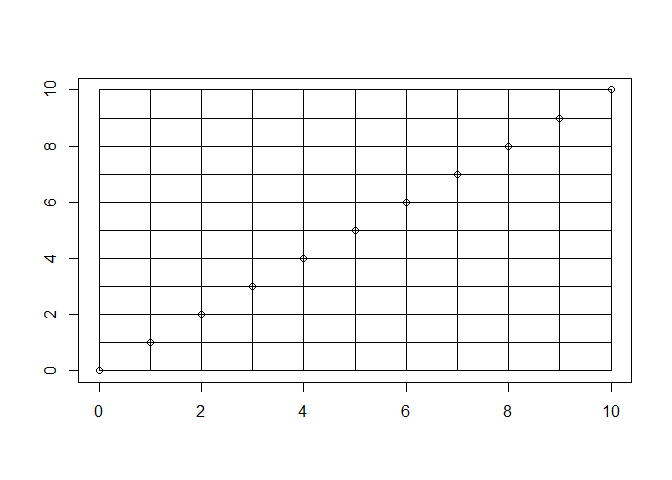

1.
--

Store the verse in the song\[\], and then print the steps we need. The last verse is different from previous verses.

``` r
song=vector(length=100)
for (i in 100:2) {
  song[i]=sprintf("%i bottles of beer on the wall, %i bottles of beer. Take one down, pass it around, %i bottles of beer on the wall...", i-1, i-1, i-2)
}
song[1]="No more bottles of beer on the wall, no more bottles of beer. Go to the store and buy some more, 99 bottles of beer on the wall.."
for (i in 100:96){
  print(song[i])
}
```

    ## [1] "99 bottles of beer on the wall, 99 bottles of beer. Take one down, pass it around, 98 bottles of beer on the wall..."
    ## [1] "98 bottles of beer on the wall, 98 bottles of beer. Take one down, pass it around, 97 bottles of beer on the wall..."
    ## [1] "97 bottles of beer on the wall, 97 bottles of beer. Take one down, pass it around, 96 bottles of beer on the wall..."
    ## [1] "96 bottles of beer on the wall, 96 bottles of beer. Take one down, pass it around, 95 bottles of beer on the wall..."
    ## [1] "95 bottles of beer on the wall, 95 bottles of beer. Take one down, pass it around, 94 bottles of beer on the wall..."

Convert the loop into the function loop\_song(number, vessel, liquid, surface)

``` r
loop_song <-function(number, vessel, liquid, surface){
  song=vector(length=number+1)
  for (i in number+1:2){
    song[i]=sprintf("%i %s of %s on the %s, %i %s of %s. Take one down, pass it around, %i %s of %s on the %s...", i-1, vessel, liquid, surface, i-1, vessel, liquid, i-2, vessel, liquid, surface)
  }
  song[1]=sprintf("No more %s of %s on the %s, no more %s of %s. Go to the store and buy some more, %i %s of %s on the %s..", vessel, liquid, surface, vessel, liquid, number, vessel, liquid, surface)
}

loop_song(99, "bottles", "beer", "wall")
for (i in 100:96){
  print(song[i])
}
```

    ## [1] "99 bottles of beer on the wall, 99 bottles of beer. Take one down, pass it around, 98 bottles of beer on the wall..."
    ## [1] "98 bottles of beer on the wall, 98 bottles of beer. Take one down, pass it around, 97 bottles of beer on the wall..."
    ## [1] "97 bottles of beer on the wall, 97 bottles of beer. Take one down, pass it around, 96 bottles of beer on the wall..."
    ## [1] "96 bottles of beer on the wall, 96 bottles of beer. Take one down, pass it around, 95 bottles of beer on the wall..."
    ## [1] "95 bottles of beer on the wall, 95 bottles of beer. Take one down, pass it around, 94 bottles of beer on the wall..."

2.
--

``` r
plot(1, type="n", xlab="", ylab="", xlim = c(0, 10), ylim = c(0, 10))
for (i in 0:10){
  lines(x=c(0,10), y=c(i,i))
  lines(x=c(i,i), y=c(0,10))
  points(x = i, y = i)
}
```



``` r
draw_plot<-function(size, fun){
  plot(1, type="n", xlab="", ylab="", xlim = c(0, size), ylim = c(0, size))
  if (fun=="horizontal") {for (i in 0:size) {lines(x=c(0,size), y=c(i,i))}}
  else if (fun=="vertical") {for (i in 0:size) {lines(x=c(i,i), y=c(0,size))}}
  else if (fun=="point") {for (i in 0:size) points(x = i, y = i)}
  else print("wrong")
}
```

3.
--

``` r
desc_stats<-function(c, median=FALSE){
  if (is.null(c)) return("Empty vector")
  else if (all(is.na(c))) return("Vector containing only NA")
  else {
    min=min(c, na.rm=TRUE)
    max=max(c, na.rm=TRUE)
    print(paste("the max is", max, "; the min is", min))
    if (median==TRUE) {
      med=round(median(c, na.rm=TRUE),2)
      print(paste("the median is", med))
    }
  }
}

desc_stats(c(1,3,NA), TRUE)
```

    ## [1] "the max is 3 ; the min is 1"
    ## [1] "the median is 2"
