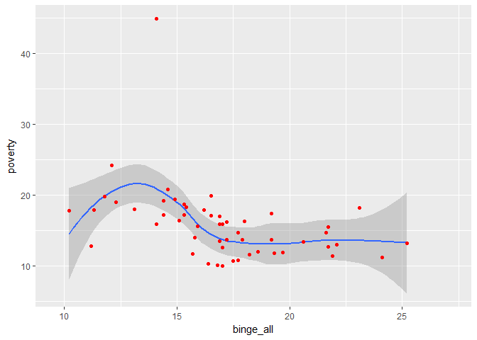

Selection of Data and Tidying
=============================

``` r
library(readr)
library(tidyr)
library(dplyr)
```

    ## 
    ## Attaching package: 'dplyr'

    ## The following objects are masked from 'package:stats':
    ## 
    ##     filter, lag

    ## The following objects are masked from 'package:base':
    ## 
    ##     intersect, setdiff, setequal, union

``` r
rawdata=read_csv("U.S._Chronic_Disease_Indicators__CDI_.csv")
```

    ## Parsed with column specification:
    ## cols(
    ##   .default = col_character(),
    ##   YearStart = col_integer(),
    ##   YearEnd = col_integer(),
    ##   DataValue = col_double(),
    ##   DataValueAlt = col_double(),
    ##   LowConfidenceLimit = col_double(),
    ##   HighConfidenceLimit = col_double()
    ## )

    ## See spec(...) for full column specifications.

    ## Warning in rbind(names(probs), probs_f): number of columns of result is not
    ## a multiple of vector length (arg 1)

    ## Warning: 1087 parsing failures.
    ## row # A tibble: 5 x 5 col      row       col expected actual expected    <int>     <chr>    <chr>  <chr> actual 1 161451 DataValue a double     No file 2 161633 DataValue a double     No row 3 162019 DataValue a double     No col 4 162460 DataValue a double     No expected 5 162494 DataValue a double     No actual # ... with 1 more variables: file <chr>
    ## ... ................. ... .................................. ........ .................................. ...... .................................. .... .................................. ... .................................. ... .................................. ........ .................................. ...... .......................................
    ## See problems(...) for more details.

``` r
f=rawdata %>% filter((Question == "Binge drinking prevalence among adults aged >= 18 years" | Question == "Poverty") & DataValueType == "Crude Prevalence" & DataValueUnit == "%" & (StratificationCategory1 == "Gender" | StratificationCategory1 == "Overall"))
s=f %>% select(LocationDesc, LocationAbbr, YearStart, Question, Stratification1, DataValue)
u=s %>% unite(type, Question, Stratification1)
k=u %>% spread(key="type", value="DataValue")
clean=k %>% rename(state= "LocationDesc", stateabb="LocationAbbr", year="YearStart", binge_female="Binge drinking prevalence among adults aged >= 18 years_Female", binge_male="Binge drinking prevalence among adults aged >= 18 years_Male", binge_all="Binge drinking prevalence among adults aged >= 18 years_Overall", poverty= "Poverty_Overall")
write.csv(clean,file="binge_clean.csv")
```

Data Transformation and Summary Results
=======================================

### 5.

``` r
library(readr)
library(tidyr)
library(dplyr)
library(DT)

data=read_csv("binge_clean.csv")
```

    ## Warning: Missing column names filled in: 'X1' [1]

    ## Parsed with column specification:
    ## cols(
    ##   X1 = col_integer(),
    ##   state = col_character(),
    ##   stateabb = col_character(),
    ##   year = col_integer(),
    ##   binge_female = col_double(),
    ##   binge_male = col_double(),
    ##   binge_all = col_double(),
    ##   poverty = col_double()
    ## )

``` r
sdata=data %>% select(year, state, binge_female, binge_male, binge_all)
adata=sdata %>% arrange(desc(binge_all))
fdata=adata %>% filter(year=="2015")
tbl_df(fdata[1:10,])
```

    ## # A tibble: 10 x 5
    ##     year                state binge_female binge_male binge_all
    ##    <int>                <chr>        <dbl>      <dbl>     <dbl>
    ##  1  2015 District of Columbia         21.9       33.1      27.2
    ##  2  2015         North Dakota         16.9       31.0      24.1
    ##  3  2015            Wisconsin         17.1       28.9      22.9
    ##  4  2015                 Guam         11.4       30.8      21.2
    ##  5  2015               Alaska         16.4       23.9      20.3
    ##  6  2015             Illinois         14.4       26.4      20.2
    ##  7  2015                 Iowa         13.3       26.6      19.8
    ##  8  2015              Montana         13.2       26.5      19.8
    ##  9  2015            Minnesota         14.0       25.2      19.5
    ## 10  2015             Nebraska         13.1       26.0      19.5

``` r
#View(fdata[1:10,])
#datatable(fdata[1:10,])
```

I don't know which one is the table you required to be so I write down other two ways I find

### 6.

``` r
library(ggplot2)
ggplot(data,aes(x=binge_all,y=poverty))+geom_smooth(method='loess')+geom_point(color='red')
```

    ## Warning: Removed 222 rows containing non-finite values (stat_smooth).

    ## Warning: Removed 222 rows containing missing values (geom_point).



It seems that in a state, higher the prevalence of binge drinking first comes with higher poverty prevalence, but when it reaches a certain prevalence, it has a converse correlation relationship with poverty. And then when prevalence of binge drinking continues to increase, poverty prevalence doesn't change any more. This may because when people are poor, they tend to drink some binge to confort themselves. However they don't have much money left for alcohol, which doesn't result in high prevalence of binge drinking. So when prevalence of binge drinking is very high, it has little relationship with poverty.

### 7.

``` r
fdata=data %>% filter( binge_all!="NA")
gdata=fdata %>% group_by(state) %>% summarize(growth=(last(binge_all, order_by=year)/first(binge_all, order_by=year)-1)/5*100, dataunit='%')
arrangedata=gdata %>% arrange(desc(growth))
n=nrow(arrangedata)
tbl_df(arrangedata[c(1:5,(n-4):n),])
```

    ## # A tibble: 10 x 3
    ##                   state    growth dataunit
    ##                   <chr>     <dbl>    <chr>
    ##  1                 Guam  3.169399        %
    ##  2 District of Columbia  1.760000        %
    ##  3            Louisiana  1.490683        %
    ##  4        West Virginia  0.990099        %
    ##  5            Tennessee  0.600000        %
    ##  6             Maryland -4.222222        %
    ##  7           New Mexico -4.268293        %
    ##  8         South Dakota -4.705882        %
    ##  9               Nevada -4.731183        %
    ## 10             Delaware -5.320197        %

``` r
#View(arrangedata[c(1:5,(n-4):n),])
#datatable(arrangedata[c(1:5,(n-4):n),])
```

I don't know which one is the table you required to be so I write down other two ways I find
